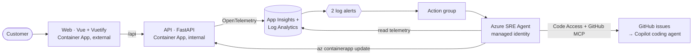

# Azure SRE Agent demo — Contoso Trek

A complete, reproducible kit for a **90-minute Azure SRE Agent session**: a live demo application operated by an
[Azure SRE Agent](https://learn.microsoft.com/azure/sre-agent/overview), infrastructure as code, agent configuration as
code, a GitHub Actions deployment pipeline, and the session materials (deck, pitch, demo script, FAQ, narrated video).

[](docs/session/video/sre-agent-demo.mp4)

| | Scenario 1 — code defect | Scenario 2 — platform fault |
| --- | --- | --- |
| **Symptom** | HTTP 500 on Climbing product pages | HTTP 503, catalog down after a config change |
| **Alert** | `alert-trek-app-exception-<env>` | `alert-trek-availability-<env>` |
| **Handled by** | `code-investigator` subagent (no Azure write tools) | `platform-operator` subagent (Azure CLI write, no GitHub/terminal) |
| **Agent response** | Finds `catalog.py:119`, files a GitHub issue, assigns **GitHub Copilot coding agent** (draft PR) | Correlates the Activity Log change, runs `az containerapp update`, verifies recovery |
| **Measured live** | Alert → issue + PR in ~3 min | Alert → verified recovery in ~5 min |

## Session materials

Everything for the session lives in [`docs/session/`](docs/session/README.md):

- **Deck** — [Marp source](docs/session/deck/azure-sre-agent.md) with speaker notes, exported to
  [PPTX](docs/session/deck/azure-sre-agent.pptx), [PDF](docs/session/deck/azure-sre-agent.pdf) and
  [HTML](docs/session/deck/azure-sre-agent.html) — 50 slides covering capabilities, benefits, **pricing** and **limits**.
- **Run of show** — [90-minute agenda](docs/session/agenda.md).
- **Pitch & narrative** — [pitch-narrative.md](docs/session/pitch-narrative.md) (elevator pitch, personas, objections).
- **Demo script** — [demo-script.md](docs/session/demo-script.md) with exact commands, timings and plan B.
- **FAQ** — [faq.md](docs/session/faq.md).
- **Video** — [7½-minute English-narrated recording](docs/session/video/README.md) of the live demo.
- **Research** — [cited research brief](docs/session/research/sre-agent-research.md).

## Architecture



| Path | Contents |
| --- | --- |
| [`src/api`](src/api) | FastAPI catalog API (Python 3.12) — contains the deliberate scenario-1 defect |
| [`src/web`](src/web) | Vue 3 + Vuetify storefront with live status banner, served by nginx |
| [`infra`](infra) | Bicep: Log Analytics, App Insights, ACR, Container Apps, SRE Agent (`Microsoft.App/agents@2026-01-01`), RBAC, alerts |
| [`sre-config`](sre-config) | Agent instructions, knowledge base, skills, subagents, tool grants, response plans, GitHub MCP tools |
| [`scripts`](scripts) | Deploy, configure agent, break/fix, smoke test, chat with the agent, teardown |
| [`.github/workflows`](.github/workflows) | `deploy.yml` (validate → deploy → configure agent → smoke test), `teardown.yml` |

## Deploy with GitHub Actions

1. Fork the repository and enable Issues.
2. Add repository secrets:
   - `AZURE_CREDENTIALS` — service principal JSON (`clientId`, `clientSecret`, `subscriptionId`, `tenantId`) with
     **Owner** (or Contributor + User Access Administrator) on the subscription, because the template assigns roles.
     *Preferred:* configure OIDC instead — add a federated credential to the app registration and set repository
     **variables** `AZURE_CLIENT_ID`, `AZURE_TENANT_ID`, `AZURE_SUBSCRIPTION_ID`; the workflow then uses OIDC automatically.
   - `SRE_AGENT_GITHUB_PAT` — token the agent uses for Code Access and the GitHub MCP connector
     (fine-grained: Contents read, Issues read/write, Pull requests read).
3. Push to `main` or run **Deploy Contoso Trek SRE demo** manually (inputs: environment name, region).
   The job summary prints the storefront URL. Allow ~6 minutes.

Region defaults to `francecentral`; any [SRE Agent region](https://learn.microsoft.com/azure/sre-agent/supported-regions) works.

## Deploy from a terminal

Requires Azure CLI, Docker, `jq` and bash (Linux, macOS, WSL or Git Bash).

```bash
az login
export ENV_NAME=demo LOCATION=francecentral
bash scripts/deploy.sh
GITHUB_REPOSITORY=owner/repo SRE_AGENT_GITHUB_PAT=<token> bash scripts/configure-agent.sh
bash scripts/smoke-test.sh
```

## Run the scenarios

```bash
bash scripts/trigger-errors.sh   # Scenario 1: HTTP 500s on Climbing products → agent files issue
bash scripts/break-config.sh     # Scenario 2: bad INVENTORY_BACKEND → HTTP 503 → agent repairs it
bash scripts/fix-config.sh       # manual reset for scenario 2
bash scripts/ask-agent.sh "Why is the Contoso Trek catalog returning 503?"   # skip alert latency
```

Log alerts evaluate every 5 minutes, so allow **5–10 minutes** before the agent picks an incident up. Watch it at
[sre.azure.com](https://sre.azure.com). Scenario 1 is repeatable: the agent de-duplicates against open issues.
Do **not** merge the Copilot fix PR if you want to keep demonstrating scenario 1.

## Costs and clean-up

The SRE Agent bills **4 AAU per hour** while it exists (≈ $292/month in East US at $0.10/AAU; $0.11 in France Central)
plus token-based active usage — see [pricing](docs/session/deck/azure-sre-agent.md). Container Apps, ACR Basic and
Log Analytics add a few dollars per day. Tear down when you are done:

```bash
bash scripts/teardown.sh          # or run the "Teardown" workflow
```

## Standards

Built to [frkim/ai-coding-standards](https://github.com/frkim/ai-coding-standards): managed identities, least-privilege
RBAC, Bicep, pinned GitHub Actions on Node 24, Microsoft-protected package feeds, tests in CI. Maintainer notes and
SRE Agent data-plane gotchas are in [AGENTS.md](AGENTS.md). Inspired by
[arnaud-tincelin/sre-agent-demo](https://github.com/arnaud-tincelin/sre-agent-demo).
