<!-- _class: title -->

# Azure SRE Agent

A 90-minute customer / partner session on agentic operations, governed autonomy, and the Contoso Trek demo.
Azure Container Apps Azure Monitor GitHub SRE Agent

<!-- Presenter notes: Open with outcomes: faster triage, less toil, and safer automation. Say numbers are cited or marked for verification. -->

---

# 90-minute flow

<table><tr><th>Time</th><th>Segment</th><th>Outcome</th></tr><tr><td>0–10</td><td>Opening and on-call problem</td><td>Shared urgency</td></tr><tr><td>10–30</td><td>What it is + architecture</td><td>Operating model</td></tr><tr><td>30–50</td><td>Governance, benefits, pricing, limits</td><td>Adoption confidence</td></tr><tr><td>50–80</td><td>Live demos 1–4</td><td>Evidence in action</td></tr><tr><td>80–90</td><td>FAQ and CTA</td><td>Agree next steps</td></tr></table>

<!-- Presenter notes: Keep the first half crisp so demos start on time. -->

---

<!-- _class: divider -->

# The on-call problem

Too much signal, too little context, and too many late-night decisions made under pressure.

<!-- Presenter notes: Transition from pain to need. -->

---

# Why incidents still take too long

<h3>Context switching</h3>
Telemetry, resource state, code, work items, runbooks, and chat history live in different tools.

<h3>Manual correlation</h3>
Engineers reconstruct topology, recent changes, and prior fixes while the incident clock runs.

<h3>Approval anxiety</h3>
Teams want automation, but not unbounded production changes.

<h3>Knowledge loss</h3>
Lessons from one incident rarely become searchable guidance for the next one.

<!-- Presenter notes: Ask which pain hurts most. -->

---

<!-- _class: divider -->

# What Azure SRE Agent is

A Microsoft-managed agentic AI service for cloud operations, incident response, and reliability workflows.

<!-- Presenter notes: Definition slide. -->

---

# Product in one sentence

Azure SRE Agent connects to Azure resources, observability tools, incident platforms, and source-code repos so teams investigate and respond from one grounded workspace.

<h3>Automate incidents</h3>
Alert → query → correlate → root cause → mitigation proposal or action.

<h3>Automate workflows</h3>
Scheduled tasks run proactive checks and compliance sweeps.

<h3>Investigate & advise</h3>
Natural-language Q&A with connected evidence and citations.

Source: <a href="https://learn.microsoft.com/en-us/azure/sre-agent/overview">Azure SRE Agent overview</a>.

<!-- Presenter notes: Use the three official usage patterns. -->

---

# Timeline and maturity

<h3>May 2025</h3>
Public preview announced at Microsoft Build.

<h3>Mar 2026</h3>
General availability with new capabilities.

<h3>Mid 2026</h3>
Azure Connector Namespace public preview.

<h3>Aug 2026</h3>
30-day trial GA, VNet GA, Live Reports preview.

Sources: <a href="https://www.microsoft.com/releasecommunications/api/v2/azure/rss/494483">Preview</a>; <a href="https://www.microsoft.com/releasecommunications/api/v2/azure/rss/558321">GA</a>; <a href="https://www.microsoft.com/releasecommunications/api/v2/azure/rss/569760">Aug update</a>; <a href="https://devblogs.microsoft.com/azure-sdk/power-azure-sre-agent-with-connector-namespace/">Connector Namespace</a>.

<!-- Presenter notes: Avoid unverified Ignite date details. -->

---

# Newest capabilities to know

<h3>Live Reports (preview)</h3>
Saved, reusable, auto-refreshing operational dashboards created from chat.

<h3>VNet integration (GA)</h3>
Route outbound traffic through customer VNet, NSG, DNS, and firewall.

<h3>30-day trial (GA)</h3>
Always-on charges waived for new customers, up to three agents; consumption still applies.

<h3>Connector Namespace (preview)</h3>
Managed MCP server hosting; early catalog includes Azure SQL, Cosmos DB, GitLab, Jira, PagerDuty.

Sources: <a href="https://learn.microsoft.com/en-us/azure/sre-agent/live-reports">Live Reports</a>; <a href="https://learn.microsoft.com/en-us/azure/sre-agent/network-integration">VNet</a>; <a href="https://learn.microsoft.com/en-us/azure/sre-agent/evaluate">Trial</a>; <a href="https://devblogs.microsoft.com/azure-sdk/power-azure-sre-agent-with-connector-namespace/">Connector Namespace</a>.

<!-- Presenter notes: Customers may have seen older preview material. -->

---

<!-- _class: divider -->

# Architecture and how it works

Signals enter; context is gathered; governed agents act or advise; memory improves the next run.

<!-- Presenter notes: Set up the visual architecture. -->

---

# Operating model

<!-- Presenter notes: Walk left to right from signal to governed outcome. -->

---

# Incident response loop

<!-- Presenter notes: Use this to explain the two demos. -->

---

# Incident platforms and response plans

<h3>Platforms</h3>
Azure Monitor, PagerDuty, and ServiceNow. Only one active incident platform at a time.

<h3>Azure Monitor details</h3>
Scanner checks every 1 minute, up to 250 alerts per API call, status sync every 5 minutes, merge lookback 7 days.

Sources: <a href="https://learn.microsoft.com/en-us/azure/sre-agent/incident-platforms">Incident platforms</a>; <a href="https://learn.microsoft.com/en-us/azure/sre-agent/azure-monitor-alerts">Azure Monitor alerts</a>; <a href="https://learn.microsoft.com/en-us/azure/sre-agent/incident-response-plans">Response plans</a>.

<!-- Presenter notes: Response plans route by filters to custom agents and run modes. -->

---

# Memory and knowledge

<h3>Past incidents</h3>
Automatic learning captures symptoms, working steps, root cause, and pitfalls.

<h3>User memories</h3>
Commands #remember, #retrieve, and #forget store explicit facts.

<h3>Knowledge base</h3>
Uploaded runbooks and docs become searchable, cited operational context.

Source: <a href="https://learn.microsoft.com/en-us/azure/sre-agent/memory">Memory and knowledge</a>.

<!-- Presenter notes: Tie this to uploaded runbooks. -->

---

# Skills, custom agents, response plans

<h3>Skills</h3>
Reusable procedures with optional tools and files; auto-loaded when relevant.

<h3>Custom agents</h3>
Specialists with prompts, tools, connectors, and skills.

<h3>Response plans</h3>
Route matching incidents to the right specialist and autonomy level.

Sources: <a href="https://learn.microsoft.com/en-us/azure/sre-agent/overview">Overview</a>; <a href="https://learn.microsoft.com/en-us/azure/sre-agent/incident-response-plans">Response plans</a>.

<!-- Presenter notes: Introduce code-investigator and platform-operator. -->

---

# Connectors, triggers, collaboration

<h3>MCP connectors</h3>
Datadog, Splunk, New Relic, Dynatrace, Elasticsearch, GitHub; 80-tool budget; 60-second heartbeat.

<h3>HTTP triggers</h3>
Webhook endpoints for CI/CD and external monitoring systems.

<h3>Scheduled tasks</h3>
Recurring natural-language investigations that create full threads.

<h3>Teams / Outlook</h3>
Post updates to Teams or send summaries by email; managed connectors add preview governance.

Sources: <a href="https://learn.microsoft.com/en-us/azure/sre-agent/mcp-connectors">MCP</a>; <a href="https://learn.microsoft.com/en-us/azure/sre-agent/http-triggers">HTTP triggers</a>; <a href="https://learn.microsoft.com/en-us/azure/sre-agent/scheduled-tasks">Scheduled tasks</a>.

<!-- Presenter notes: Azure is native; external systems are connector mediated. -->

---

# Code Access and developer workflow

<h3>Code Access</h3>
Configured by PAT with <code>PUT /api/v2/repos/{name}</code> so the agent can search code and read files by path/branch.

<h3>GitHub MCP connector</h3>
Agent connector type <code>Mcp</code> at <code>https://api.githubcopilot.com/mcp/</code>; selected tools are exposed as <code>github_*</code>.

<h3>Selected tools</h3>
<code>issue_write</code>, <code>issue_read</code>, <code>search_issues</code>, <code>add_issue_comment</code>, <code>search_code</code>, commits, file reads, and <code>assign_copilot_to_issue</code>.

<h3>Developer hand-off</h3>
The code investigator de-duplicates, files the issue with file:line, then assigns GitHub Copilot coding agent for a draft PR.

Source: live demo configuration and <a href="https://learn.microsoft.com/en-us/azure/sre-agent/github-connector">GitHub connector docs</a>.

<!-- Presenter notes: Update this from the live deployment: the demo uses Code Access plus GitHub MCP, not a generic GitHub connector-only story. -->

---

# From incident to pull request

<h3>1. SRE Agent</h3>
Correlates alert, telemetry, stack trace, source, and prior knowledge.

<h3>2. GitHub issue</h3>
Searches existing issues, avoids duplicates, and writes impact + stack + file:line.

<h3>3. Copilot coding agent</h3>
<code>github_assign_copilot_to_issue</code> opens a draft PR for human review.

<strong>Human control point:</strong> the PR is reviewed and merged by the team; SRE Agent observes post-deploy signals to verify recovery.

<!-- Presenter notes: Make the hand-off concrete: incident response creates a developer-ready issue and Copilot coding agent drafts, but humans review the PR. -->

---

<!-- _class: divider -->

# Governance and security

Autonomy is useful only when the blast radius is explicit and auditable.

<!-- Presenter notes: Confidence section. -->

---

# Governance stack

<!-- Presenter notes: Four independent gates must align. -->

---

# Roles and separation of duties

<table><tr><th>Role</th><th>Best-fit responsibility</th></tr><tr><td>SRE Agent Reader</td><td>View threads, logs, and incidents.</td></tr><tr><td>SRE Agent Standard User</td><td>Chat, run diagnostics, request actions, scheduled tasks, knowledge uploads.</td></tr><tr><td>SRE Agent Author</td><td>Create custom agents and response plans; configure incident management.</td></tr><tr><td>SRE Agent Administrator</td><td>Approve actions, manage connectors, delete resources, full control.</td></tr></table>
Source: <a href="https://learn.microsoft.com/en-us/azure/sre-agent/user-roles">User roles</a>.

<!-- Presenter notes: Map roles to personas. -->

---

# Run modes and RBAC are different

<h3>Run mode</h3>
Review is default; Administrator approves/denies Azure infrastructure writes. Autonomous executes immediately within permissions.

<h3>Permission level</h3>
Reader grants read diagnostics and OBO fallback; Privileged grants resource-type contributor roles on selected resource groups.

Sources: <a href="https://learn.microsoft.com/en-us/azure/sre-agent/run-modes">Run modes</a>; <a href="https://learn.microsoft.com/en-us/azure/sre-agent/permissions">Permissions</a>.

<!-- Presenter notes: The agent needs both workflow and resource access. -->

---

# Data, network, audit posture

<h3>Data use</h3>
Microsoft does not use customer data to train AI models; data is tenant/subscription isolated.

<h3>Residency</h3>
Conversation/content data is stored and processed in the selected Azure region.

<h3>Network</h3>
VNet integration is GA and optional: Unrestricted, Limited, or Azure VNet.

Sources: <a href="https://learn.microsoft.com/en-us/azure/sre-agent/data-privacy">Data privacy</a>; <a href="https://learn.microsoft.com/en-us/azure/sre-agent/network-integration">Network integration</a>.

<!-- Presenter notes: If EU comes up, explain provider choices. -->

---

<!-- _class: divider -->

# Benefits

Faster investigation, lower toil, safer repeatability — with cited Microsoft and customer proof points.

<!-- Presenter notes: Move to value. -->

---

# Quantified proof points

3,000+

Internal Microsoft services scaled on Azure SRE Agent.

1.5M+

Incidents processed internally at Microsoft.

50%

Up to half resolved autonomously in Microsoft internal usage.

<strong>Customer signal:</strong> InEight reported 80% reduction in incident investigation time and 80% reduction in build-failure triage time.

Source: <a href="https://developer.microsoft.com/blog/try-azure-sre-agent-with-no-always-on-charges/">Microsoft Developer blog, Aug 2026</a>.

<!-- Presenter notes: Use official stats only. -->

---

<!-- _class: divider -->

# Pricing and cost controls

AAUs make agent cost visible: fixed always-on plus variable active-flow consumption.

<!-- Presenter notes: Signal that AAU unit prices are now verified and region-specific. -->

---

# Pricing model

<h3>Always-on flow</h3>
<strong>4 AAUs per agent-hour</strong> from creation until deletion. Stopping pauses active flow, not always-on billing.

<h3>Verified AAU unit price</h3>
Retail Prices API, queried 2026-10-03: East US / East US 2 <strong>$0.10</strong>; France Central / Sweden Central <strong>$0.11</strong>; West Europe <strong>$0.14</strong> effective 2026-10-01; France Central <strong>EUR 0.10</strong>.

<strong>Quote discipline:</strong> prices vary by region and currency; confirm current values in the Azure pricing calculator for customer quotes.

Sources: <a href="https://learn.microsoft.com/en-us/azure/sre-agent/pricing-billing">Pricing and billing</a>; <a href="https://prices.azure.com/api/retail/prices?$filter=meterName%20eq%20%27SRE%20Agent%20Unit%27">Azure Retail Prices API</a> queried 2026-10-03.

<!-- Presenter notes: State the now-verified Retail Prices API values, but keep quote discipline because pricing can vary by region and currency. -->

---

# Active-flow AAU rates per 1M tokens

<table><tr><th>Model</th><th>Input</th><th>Output</th><th>Cache read</th><th>Cache write</th></tr><tr><td>Claude Opus 4.6</td><td>100</td><td>500</td><td>10</td><td>125</td></tr><tr><td>GPT 5.3 Codex</td><td>35</td><td>280</td><td>3.5</td><td>0</td></tr><tr><td>GPT 5.2</td><td>35</td><td>280</td><td>3.5</td><td>0</td></tr></table>
<strong>Official examples:</strong> quick question ≈ 3.8 AAUs (Claude) / 1.3 (GPT 5.3 Codex); incident investigation ≈ 35.3 / 11.7; full remediation ≈ 86.5 / 30.1.

Source: <a href="https://learn.microsoft.com/en-us/azure/sre-agent/pricing-billing">Pricing and billing</a>.

<!-- Presenter notes: Explain cache reads are cheaper. -->

---

# Worked monthly estimate

<h3>Always-on floor</h3>
4 AAU × 730 h = <strong>2,920 AAU/month</strong> ≈ <strong>$292</strong> in East US or <strong>$321</strong> in France Central.

<h3>20 investigations/month</h3>
GPT-5.3 Codex example: 11.7 × 20 ≈ <strong>234 AAU</strong> ≈ <strong>$23</strong> East US / <strong>$26</strong> France Central.

<h3>Claude investigation mix</h3>
Claude Opus example: 35.3 × 20 ≈ <strong>706 AAU</strong> ≈ <strong>$71</strong> East US / <strong>$78</strong> France Central.

<h3>Small-team monthly shape</h3>
1 agent + 20 GPT investigations + 10 GPT remediations + 100 quick questions ≈ <strong>3,585 AAU</strong> ≈ <strong>$359</strong> East US / <strong>$394</strong> France Central.

<strong>Hours comparison:</strong> break-even hours = monthly agent cost ÷ your loaded on-call engineering cost/hour. At an illustrative $100/hour, the small-team East US shape breaks even at about 3.6 saved hours/month.

Sources: <a href="https://learn.microsoft.com/en-us/azure/sre-agent/pricing-billing">Pricing and billing</a>; <a href="https://prices.azure.com/api/retail/prices?$filter=meterName%20eq%20%27SRE%20Agent%20Unit%27">Azure Retail Prices API</a> queried 2026-10-03.

<!-- Presenter notes: Show how AAUs translate into dollars and compare to on-call hours using the customer’s actual loaded labor rate. -->

---

# Budget cap and trial

<h3>Monthly active-flow limit</h3>
Configurable 500 to 1,000,000 AAUs. Hitting it pauses chat/actions; always-on billing continues.

<h3>30-day trial</h3>
Always-on charges waived for up to 3 new agents. Active-flow charges still apply; deleted agents still count.

Sources: <a href="https://learn.microsoft.com/en-us/azure/sre-agent/pricing-billing">Pricing and billing</a>; <a href="https://learn.microsoft.com/en-us/azure/sre-agent/evaluate">Evaluate</a>.

<!-- Presenter notes: Deletion is the only full stop. -->

---

<!-- _class: divider -->

# Limits and quotas

Adoption planning needs the sharp edges on the table early.

<!-- Presenter notes: Limits are design inputs. -->

---

# Selected published limits

<table><tr><th>Area</th><th>Limit / fact</th></tr><tr><td>Regions</td><td>22 confirmed supported Azure regions; one deployment region; cannot change after creation.</td></tr><tr><td>MCP tools</td><td>80 tools per agent; 60-second health heartbeat; new tools detected within 5 minutes.</td></tr><tr><td>Knowledge</td><td>.md/.txt only; max 50 MB per file; up to 1,000 files per custom agent instance.</td></tr><tr><td>GitHub OAuth</td><td>10 OAuth tokens per agent.</td></tr><tr><td>Incidents</td><td>One active incident platform per agent.</td></tr></table>
Sources: <a href="https://learn.microsoft.com/en-us/azure/sre-agent/supported-regions">Regions</a>; <a href="https://learn.microsoft.com/en-us/azure/sre-agent/mcp-connectors">MCP</a>; <a href="https://learn.microsoft.com/en-us/azure/sre-agent/github-connector">GitHub</a>; <a href="https://learn.microsoft.com/en-us/azure/sre-agent/incident-platforms">Incident platforms</a>.

<!-- Presenter notes: No public concurrent incident/chat cap found. -->

---

# Preview / verify items

<ul>
<li><strong>Preview:</strong> Managed connectors, Connector Namespace, Live Reports, and control/data-plane REST APIs have preview caveats in current docs.</li>
<li><strong>Verify before automation:</strong> exact API version, service-principal auto-admin behavior, and concurrent-thread quotas.</li>
<li><strong>Quote discipline:</strong> AAU prices are verified for the listed regions, but prices vary by region/currency; confirm current values in the calculator for customer quotes.</li>
</ul>

Sources: <a href="https://learn.microsoft.com/en-us/azure/sre-agent/api-reference">API reference</a>; <a href="https://prices.azure.com/api/retail/prices?$filter=meterName%20eq%20%27SRE%20Agent%20Unit%27">Azure Retail Prices API</a>.

<!-- Presenter notes: Remove the old unresolved price verification item and keep quote discipline plus remaining technical verify items. -->

---

<!-- _class: divider -->

# Live demo runway

Contoso Trek: an outdoor-gear storefront on Azure Container Apps with Azure SRE Agent as operator.

<!-- Presenter notes: Switch to demo mode. -->

---

<!-- _class: divider -->

# Demo 1 — deploy from GitHub Actions

Show the deployment story: source, workflow, Bicep, images, agent resource, and smoke test.

<!-- Presenter notes: Open GitHub Actions and Azure portal. -->

---

# Demo 1 talk-track

<h3>Show</h3><ul><li><code>.github/workflows/deploy.yml</code></li><li><code>scripts/deploy.sh</code></li><li>Bicep modules under <code>infra/</code></li><li>GitHub Actions run summary</li></ul>

<h3>Say</h3>
The agent is deployed and configured like any Azure resource: versioned, reviewed, and repeatable.

<pre><code>bash scripts/deploy.sh
bash scripts/configure-agent.sh
bash scripts/smoke-test.sh</code></pre>

<!-- Presenter notes: If deployed, show workflow summary instead of waiting. -->

---

# Agent config as code

<h3>Response plans</h3>
<code>app-exception</code> → <code>code-investigator</code> <code>availability</code> → <code>platform-operator</code>

<h3>Least privilege by tool grant</h3>
Code investigator: no Azure write tools. Platform operator: Azure CLI write but no terminal/GitHub. Read-back verification reports <code>phantom=none</code>.

<pre><code>sre-config/agent-config.json
sre-config/skills/*.md
sre-config/instructions/*.md
sre-config/knowledge-base/*.md</code></pre>

<!-- Presenter notes: The guardrail is not just prompt text; it is verified tool grants per subagent with no phantom tools. -->

---

<!-- _class: divider -->

# Demo 2 — code defect to GitHub issue

A Climbing product detail throws HTTP 500; the agent identifies the source defect and files an issue.

<!-- Presenter notes: No Azure action can fix this class of problem. -->

---

# Demo 2 steps and expected outcome

<h3>Run</h3><pre><code>REQUESTS=20 bash scripts/trigger-errors.sh</code></pre>
Wait 5–10 minutes for the alert, or use <code>scripts/ask-agent.sh</code> to skip alert latency.

<h3>Expected</h3><ul><li>Agent follows AppExceptions and stack trace.</li><li>Searches existing issues to avoid duplicates.</li><li>Files GitHub issue with impact, stack excerpt, file:line, suggested fix.</li><li>Hands off to Copilot coding agent with <code>github_assign_copilot_to_issue</code> for a draft PR.</li></ul>

<!-- Presenter notes: While waiting, show the GitHub MCP connector tools and explain that the PR remains human-reviewed. -->

---

<!-- _class: divider -->

# Demo 3 — config fault to autonomous fix

A bad Container App environment variable causes 503s; the agent restores known-good configuration and verifies recovery.

<!-- Presenter notes: This is scoped autonomous repair. -->

---

# Demo 3 steps and expected outcome

<h3>Run</h3><pre><code>BAD_INVENTORY_BACKEND=cosmosdb-prod bash scripts/break-config.sh</code></pre>
The availability alert fires in about 5–10 minutes.

<h3>Expected</h3><ul><li>Finds <code>CONFIG_ERROR</code> traces.</li><li>Correlates Activity Log / revision change.</li><li>Runs <code>az containerapp update ... INVENTORY_BACKEND=builtin</code>.</li><li>Verifies <code>/health/ready</code> and status return green.</li></ul>

<!-- Presenter notes: If delayed, run fix-config and narrate expected evidence. -->

---

<!-- _class: divider -->

# Demo 4 — chat, scheduled task, Q&A with the agent

Use the agent as a reliability analyst before and after alerts.

<!-- Presenter notes: This can fill time during alert latency. -->

---

# Demo 4 prompts

<pre><code>bash scripts/ask-agent.sh "Summarize Contoso Trek health and recent errors. Cite evidence."

bash scripts/ask-agent.sh "Create a concise readiness report for ca-trek-api and ca-trek-web."

bash scripts/ask-agent.sh "What recurring scheduled task would you recommend for this workload?"</code></pre>
<strong>Show at sre.azure.com:</strong> chat thread, evidence links, tool calls, and scheduled task management.

<!-- Presenter notes: Ask one customer-supplied question. -->

---

<!-- _class: divider -->

# Getting started

Pilot safely: choose scope, seed knowledge, measure outcomes, then expand autonomy.

<!-- Presenter notes: From demo to adoption. -->

---

# Prerequisites and deployment choices

<h3>Azure prerequisites</h3>
Microsoft.App provider registered; Owner or Contributor + User Access Administrator; supported region; monitoring available.

<h3>Automation paths</h3>
Portal for evaluation; Bicep / ARM / Terraform AzAPI; Azure Developer CLI recipes; GitHub Actions for Contoso Trek.

Sources: <a href="https://learn.microsoft.com/en-us/azure/sre-agent/evaluate">Evaluate</a>; <a href="https://learn.microsoft.com/en-us/azure/sre-agent/deploy-iac">Deploy IaC</a>; <a href="https://learn.microsoft.com/en-us/azure/sre-agent/supported-regions">Regions</a>.

<!-- Presenter notes: Partners can package repeatable deployment. -->

---

# Contoso Trek repo quick start

<pre><code># validate/deploy/configure/smoke-test
bash scripts/deploy.sh
bash scripts/configure-agent.sh
bash scripts/smoke-test.sh

# break/fix scenarios
REQUESTS=20 bash scripts/trigger-errors.sh
BAD_INVENTORY_BACKEND=cosmosdb-prod bash scripts/break-config.sh
bash scripts/fix-config.sh</code></pre>
Default environment: <code>demo</code>; default location: <code>francecentral</code>; resource group: <code>rg-sre-agent-demo-demo</code>.

<!-- Presenter notes: Commands come directly from the repo. -->

---

# Adoption roadmap

<h3>Crawl</h3>
Reader + Review. Connect telemetry, import runbooks, ask questions, measure triage time.

<h3>Walk</h3>
Review on scoped resource groups. Add response plans, scheduled tasks, GitHub/ADO issue flow.

<h3>Run</h3>
Autonomous for narrow tasks. Allow safe, reversible repairs on non-prod or tightly scoped production resources.

<!-- Presenter notes: Choose one service, two alerts, one runbook, one metric. -->

---

# Competitive landscape: fair positioning

<h3>Strong Azure-native fit</h3>
Deep native access to ARM, Resource Graph, Azure Monitor, App Insights, Log Analytics, AKS, Container Apps, App Service, and Functions.

<h3>Connector-mediated multi-tool fit</h3>
MCP, HTTP triggers, and managed connectors reach non-Azure telemetry and SaaS workflows.

<h3>Competitor strengths</h3>
PagerDuty: incident orchestration; Datadog: telemetry-native AI; cloud-neutral agents: multi-cloud-first posture.

<h3>Azure differentiator</h3>
Governed autonomy + Azure control plane + IaC-managed config + persistent memory.

Competitive claims are directional and based on third-party context in the research brief; validate for procurement use.

<!-- Presenter notes: Be balanced and fair. -->

---

<!-- _class: closing -->

# Call to action

Pick one high-signal service, two recurring incident types, and a Reader + Review pilot.

<h3>Week 1</h3>
Deploy agent, connect Azure Monitor, upload runbooks.

<h3>Week 2</h3>
Configure response plans and GitHub/ADO workflow.

<h3>Week 3–4</h3>
Measure MTTR, toil, false positives, and candidate autonomous repairs.

<!-- Presenter notes: Ask for pilot workload, owner, approver, and success metrics. -->

---

# Resources

<ul><li>Docs: <a href="https://learn.microsoft.com/en-us/azure/sre-agent/overview">https://learn.microsoft.com/en-us/azure/sre-agent/overview</a></li><li>Product page: <a href="https://azure.microsoft.com/en-us/products/sre-agent/">https://azure.microsoft.com/en-us/products/sre-agent/</a></li><li>Pricing model: <a href="https://learn.microsoft.com/en-us/azure/sre-agent/pricing-billing">pricing-billing doc</a></li><li>Retail Prices API: <a href="https://prices.azure.com/api/retail/prices">https://prices.azure.com/api/retail/prices</a></li><li>Portal: <a href="https://sre.azure.com">https://sre.azure.com</a></li><li>Contoso Trek assets: <code>infra/</code>, <code>scripts/</code>, <code>sre-config/</code>, <code>src/</code></li><li>Session materials: <code>docs/session/</code></li></ul>

<!-- Presenter notes: Pricing values are verified from the Retail Prices API; quotes should still confirm current calculator values. -->

---

# Sources used in this deck

<ul><li>Microsoft Learn Azure SRE Agent docs: overview, pricing, evaluation, roles, run modes, permissions, memory, connectors, incidents, response plans, scheduled tasks, triggers, hooks, policies, network, privacy, regions, API, IaC, Live Reports.</li><li>Azure Updates RSS: May 2025 preview, Mar 2026 GA, Aug 2026 trial / VNet / Live Reports announcement.</li><li>Microsoft Developer blog: internal scale and InEight proof points.</li><li>Microsoft Azure SDK Dev Blog: Azure Connector Namespace.</li><li>Local demo contract and repository scripts/configuration.</li></ul>

Full links are in <code>docs/session/README.md</code> and the research brief.

<!-- Presenter notes: Traceability slide; do not linger unless asked. -->
