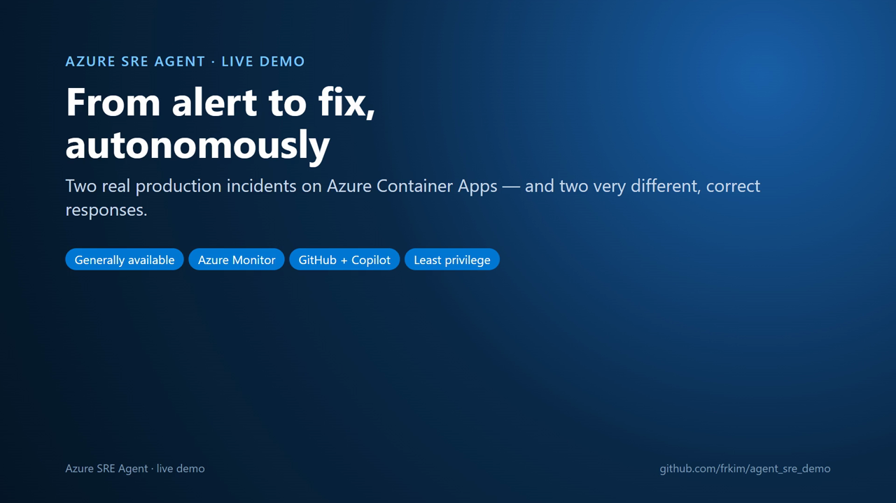

# Demo video



| File | What it is |
| --- | --- |
| [`sre-agent-demo.mp4`](sre-agent-demo.mp4) | 7½-minute English-narrated recording (1080p, H.264/AAC, embedded English subtitle track) |
| [`sre-agent-demo.en.srt`](sre-agent-demo.en.srt) | Sidecar subtitles |
| [`narration.json`](narration.json) | Narration script, one entry per scene |
| [`tooling/`](tooling/) | Scripts that recorded and assembled the video |

Everything in the video was captured live on 3 October 2026 from this repository's deployment (`rg-sre-agent-demo-demo`,
France Central). Nothing is mocked:

- **Scenario 1 (code defect)** — alert `alert-trek-app-exception-demo` fired 08:45:53 UTC; the `code-investigator`
  subagent filed [issue #4](https://github.com/frkim/agent_sre_demo/issues/4) with the `catalog.py:119` root cause and
  assigned it to GitHub Copilot coding agent, which opened [draft PR #5](https://github.com/frkim/agent_sre_demo/pull/5).
  Alert to issue + PR: ~3 minutes. No Azure resource modified.
- **Scenario 2 (config fault)** — `scripts/break-config.sh` at 09:12:18 UTC; alert `alert-trek-availability-demo` fired
  09:18:11; the `platform-operator` subagent correlated the Activity Log change, ran
  `az containerapp update --set-env-vars INVENTORY_BACKEND=builtin` at 09:21:38 and verified recovery at 09:23:38.

The agent threads are shown as rendered from the SRE Agent data-plane API (`GET /api/v1/threads/{id}/messages`);
connection-string keys are redacted. Use the video as **plan B** when alert latency or connectivity interrupts a live session.

## Storyboard

| # | Scene | Source |
| --- | --- | --- |
| 1–3 | Intro, what SRE Agent is, demo architecture | Title cards |
| 4–5 | GitHub Actions deployment, agent configuration as code | Actions run page, verification output |
| 6–11 | Storefront → HTTP 500 → agent thread → GitHub issue → Copilot PR | Live recordings |
| 12–16 | Bad config → outage → agent thread → recovery | Live recordings |
| 17–20 | Governance, pricing, limits, call to action | Title cards |

## Rebuild

Requires Python 3.12+, Microsoft Edge, and `ffmpeg` on `PATH`. Packages come from the protected feed
(`pip` is configured for `https://packagefeedproxy.microsoft.io/pypi/simple`).

```powershell
cd docs/session/video/tooling
python -m venv .venv; .\.venv\Scripts\pip install playwright edge-tts
# 1. Record live scenes against your deployment (edit URL / issue / PR / run ids in record.py first)
.\.venv\Scripts\python record.py storefront failure github_issue github_pr actions outage recovered
# 2. Save agent threads (bash scripts/ask-agent.sh or GET {endpoint}/api/v1/threads/{id}/messages) as thread-s1.json / thread-s2.json
.\.venv\Scripts\python render_transcript.py thread-s1.json "Incident thread" "subtitle" scenes\transcript_s1.html
.\.venv\Scripts\python render_transcript.py thread-s2.json "Incident thread" "subtitle" scenes\transcript_s2.html
# 3. Narrate (edge-tts, en-US-AndrewMultilingualNeural) and assemble
.\.venv\Scripts\python build_video.py
```
